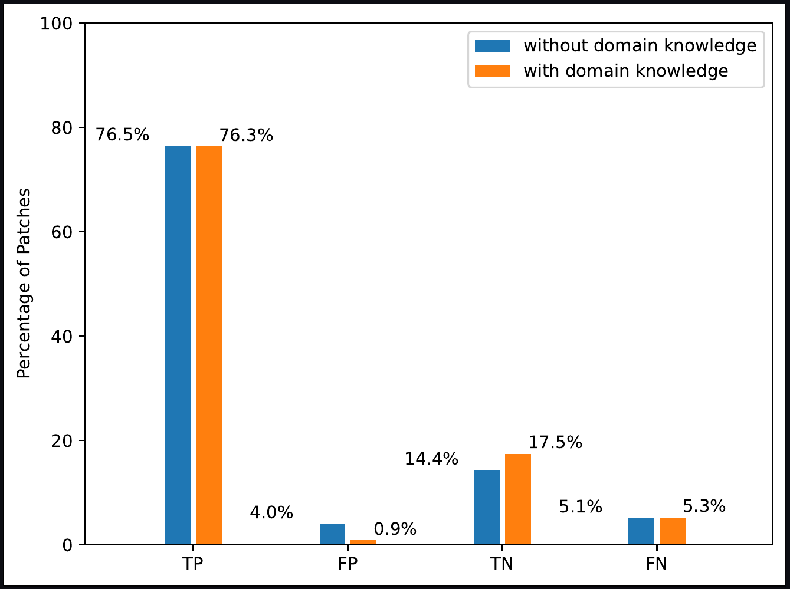

# Installation
## Installation Instructions
In the following, we describe how to build the Docker image and validate the successful installation.

### 1. Install Docker (if required)
How to install Docker depends on your operating system:

- _Windows or Mac_: You can find download and installation instructions [here](https://www.docker.com/get-started).
- _Linux Distributions_: How to install Docker on your system, depends on your distribution. The chances are high that Docker is part of your distributions package database.
Docker's [documentation](https://docs.docker.com/engine/install/) contains instructions for common distributions.

Then, start the [docker deamon](https://docs.docker.com/config/daemon/).

### 2. Open a Suitable Terminal
```
# Windows Command Prompt: 
 - Press 'Windows Key + R' on your keyboard
 - Type in 'cmd' 
 - Click 'OK' or press 'Enter' on your keyboard
 
# Windows PowerShell:
 - Open the search bar (Default: 'Windows Key') and search for 'PowerShell'
 - Start the PowerShell
 
# Linux:
 - Open the search bar (Default: 'Meta Key' (aka. 'Windows Key')) and search for 'terminal' or 'konsole'
```

Clone this repository to a directory of your choice using git:
```shell
git clone https://github.com/VariantSync/SynchronizationStudy.git
```
Then, navigate to the root of your local clone of this repository:
```shell
cd SynchronizationStudy
```

### 3. Build the Docker Container
To build the Docker container you can run the `build` script corresponding to your operating system:
```
# Windows: 
  .\build.bat
# Linux/Mac (bash): 
  ./build.sh
```

## 4. Validate the Correct Installation

### Running the Validation
The validation runs less than one percent of the original study to produce results fastly, to confirm a correct installation. 
To execute the validation, you can run the `execute` script corresponding to your operating system with `validation` as first argument.

#### Windows:
`.\execute.bat validation`
#### Linux/Mac (bash):
`./execute.sh validation`

> If you want to stop the execution, you can call the provided script for stopping the container in a separate terminal.
> #### Windows:
> `.\stop-execution.bat`
> #### Linux/Mac (bash):
> `./stop-execution.sh`

While the validation is running, it's progress is constantly printed to the terminal in which the container is running. The output should look similar to the following:

```

[12:41:15.722907182] [STATUS] [main] [ExperimentBusyBox] Cleaning state of V0 repo.
[12:41:16.549889075] [STATUS] [main] [ExperimentBusyBox] Cleaning state of V1 repo.
[12:41:17.443524205] [STATUS] [main] [Experiment] Checkout of commits in SPL repo.
[12:41:18.090978038] [STATUS] [main] [ExperimentBusyBox] Normalizing BusyBox files...
[12:41:18.597471463] [STATUS] [main] [Experiment] Starting repetition 1 of 1 with 4 variants.
[12:41:18.597563909] [STATUS] [main] [Experiment] Sampling next set of variants...
[12:41:18.597583467] [STATUS] [main] [ExperimentBusyBox] Loading feature models.
[12:41:18.638131923] [STATUS] [main] [ExperimentBusyBox] Creating model union.
[12:41:18.668583178] [STATUS] [main] [Experiment] Done. Sampled 4 variants.
[12:41:18.668785974] [STATUS] [main] [Experiment] Cleaning variants dir V0.
[12:41:18.670236005] [STATUS] [main] [Experiment] Cleaning variants dir V1.
[12:41:18.672027136] [STATUS] [main] [Experiment] Generating variants...
[12:41:18.672114356] [STATUS] [main] [Experiment] Generating variant Variant0
[12:41:18.984429563] [STATUS] [main] [Experiment] Generating variant Variant1
[12:41:18.986153269] [STATUS] [main] [Experiment] Generating variant Variant2
[12:41:18.98756974] [STATUS] [main] [Experiment] Generating variant Variant3
[12:41:18.988897532] [STATUS] [main] [Experiment] Done.
[12:41:18.988963535] [STATUS] [main] [Experiment] Starting diff application for source variant Variant0
[12:41:18.991569045] [STATUS] [main] [Experiment] Starting patch application for source variant Variant0
[12:41:18.991664764] [STATUS] [main] [Experiment] Variant0 --patch--> Variant1
[12:41:19.011302777] [STATUS] [main] [ResultAnalysis] Commit-sized patch failed
...
```

The results of the validation are stored in the [simulation-files](simulation-files) directory.

### Expected Output of the Validation
The results are saved in a simple [results](simulation-files/results.txt) file in the [simulation-files](simulation-files) directory. For each run, a JSON object containing the required evaluation data is written to the results file. 

A summary of the results is printed to the console at the end of the validation. This summary should look similar to this: 
```
[12:22:10.315467038] [STATUS] [main] [Experiment] All done.
Running result evaluation
Read a total of 345 results.
++++++++++++++++++++++++++++++++++++++
Patch Success
++++++++++++++++++++++++++++++++++++++
269 of 345 commit-sized patch applications succeeded (78.0%)
361 of 450 file-sized patch applications succeeded (80.2%)
10602 of 13110 line-sized patch applications succeeded (80.9%)
10176 of 10931 line-sized patch applications succeeded after filtering (93.1%)

++++++++++++++++++++++++++++++++++++++
Precision / Recall
++++++++++++++++++++++++++++++++++++++
Without Domain Knowledge
TP: 10024
FP: 527
TN: 1885
FN: 674
Precision: 0.95
Recall: 0.94
F-Measure: 0.94

++++++++++++++++++++++++++++++++++++++
With Domain Knowledge

TP: 10009
FP: 121
TN: 2291
FN: 689
Precision: 0.99
Recall: 0.94
F-Measure: 0.96
++++++++++++++++++++++++++++++++++++++
Accuracy
++++++++++++++++++++++++++++++++++++++
Normal patching achieved the expected result 11909 out of 13110 times
Accuracy: 90.8%
Balanced Accuracy: 0.86

Filtered patching achieved the expected result 12300 out of 13110 times
Accuracy: 93.8%
Balanced Accuracy: 0.94

++++++++++++++++++++++++++++++++++++++
Plotting figures
No chache found at /home/user/simulation-files/results.txt.cache
Opening /home/user/simulation-files/results.txt

Parsed Values:
commitPatches = 345
normal = {'name': 'normal', 'tp': 10024, 'fp': 527, 'tn': 1885, 'fn': 674, 'wrongLocation': 51, 'commitPatches': 345, 'commitSuccess': 269, 'file': 450, 'fileSuccess': 361, 'line': 13110, 'lineSuccess': 10602}
filtered = {'name': 'filtered', 'tp': 10009, 'fp': 121, 'tn': 2291, 'fn': 689, 'wrongLocation': 46, 'commitPatches': 345, 'commitSuccess': 312, 'file': 399, 'fileSuccess': 364, 'line': 10931, 'lineSuccess': 10176}

RQ1
RQ2
RQ3
Done
Cleaning temporary directories
Done.
```

#### Plots
Furthermore, the validation plots figures, similar to the ones in our paper, for the validation's results. 
After the validation is complete, the following files can be found in `simulation-files/plots`:
- [rq1_applicability](simulation-files/plots/rq1_applicability.pdf)
- [rq2_correctness](simulation-files/plots/rq2_correctness.pdf)
- [rq3_domain_knowledge](simulation-files/plots/rq3_domain_knowledge.pdf)

The created plots should look similar to the plots shown below.

> ! IMPORTANT: 
> The shown plots were created based on the results of the installation's short validation and deviate from the figures shown in the paper.

#### RQ1 Results - Similar to Fig. 5 in our paper


#### RQ2 Results - Similar to Fig. 6 in our paper


#### RQ3 Results - Similar to Fig. 7 in our paper


## Troubleshooting

### 'Got permission denied while trying to connect to the Docker daemon socket'
`Problem:` This is a common problem under Linux, if the user trying to execute Docker commands does not have the permissions to do so. 

`Fix:` You can fix this problem by either following the [post-installation instructions](https://docs.docker.com/engine/install/linux-postinstall/), or by executing the scripts in the replication package with elevated permissions (i.e., `sudo`).

### 'Unable to find image 'sync-study:latest' locally'
`Problem:` The Docker image could not be found. This either means that the name of the image that was built does not fit the name of the image that is to be executed (this only happens if you changed the provided scripts), or that the Docker image was not built yet. 

`Fix:` Follow the instructions described above in the section `Build the Docker Container`.

### No results after validation, or 'cannot create directory...: Permission denied'
`Problem:` This problem can occur due to how permissions are managed inside the Docker container. More specifically, it will appear, if Docker is executed with elevated permissions (i.e., `sudo`) and if there is no [simulation-files](simulation-files) directory because it was deleted manually. In this case, Docker will create the directory with elevated permissions, and the Docker user has no permissions to access the directory.

`Fix:` If there is a _simulation-files_ directory, delete it with elevated permission (e.g., `sudo rm -r results`). 
Then, execute `git restore simulation-files` to restore the deleted directory.

### Failed to create LLB definition: No match for platform in manifest
Please contact us if you encounter the following issue while building the Docker image:
```
=> CANCELED [internal] load metadata for docker.io/library/alpine:3.16.2                                                                                                                                                                       1.1s
=> ERROR [internal] load metadata for docker.io/library/openjdk:17-alpine
failed to solve with frontend dockerfile.v0: failed to create LLB definition: no match for platform in manifest … : not found 
```
One of the artifact's reviewers made us aware of the issue. 
We tried to address it to the hints found in [this](https://stackoverflow.com/questions/68984133/error-failed-to-solve-with-frontend-dockerfile-v0-failed-to-create-llb-definit) Stackoverflow thread. 
However, we do not have a system on which we could reproduce the issue and could therefore not verify whether it is fixed. 
